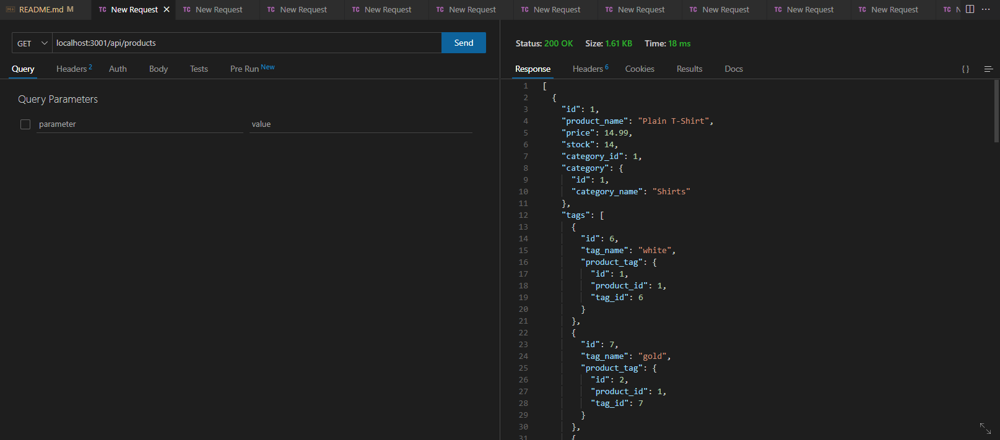

# E-Commerce Back End Application

## Description

Uses several back end packages to deliver an easy to use e-commerce system. Easily create, update, and delete products, tags, or even categories.

## Table of Contents

- [Installation](#installation)
- [Usage](#usage)
- [Credits](#credits)
- [License](#license)
- [Tests](#tests)
- [Questions](#questions)
- [Repository](#repository)

## Installation

To install this application to your local machine, please run '$ npm i' to install all necessary packages.

## Mockup

## Link to Functionality Demonstration

https://drive.google.com/file/d/1ickklErlKr8vUr-ES_OJdLfZIBLBW-7O/view

## License

MIT

## Questions?

https://github.com/artiecannv/

## Repository

https://github.com/artiecannv/e-commerce
